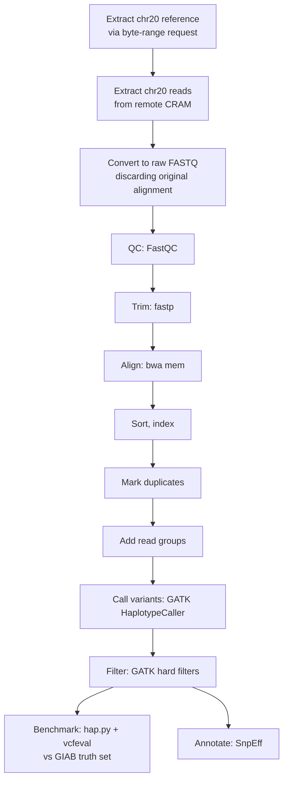
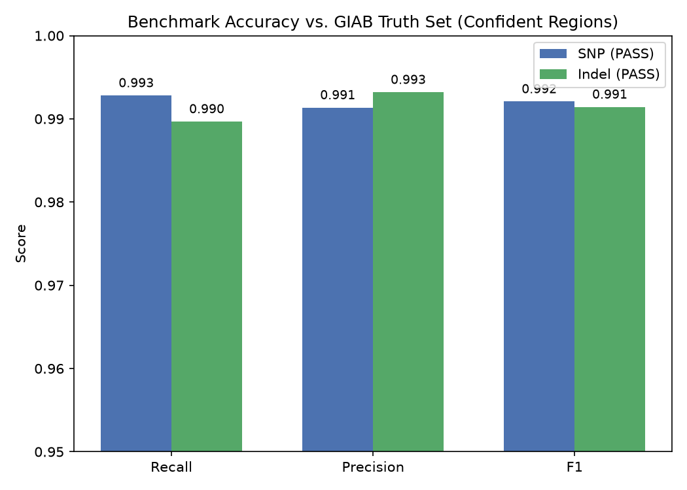
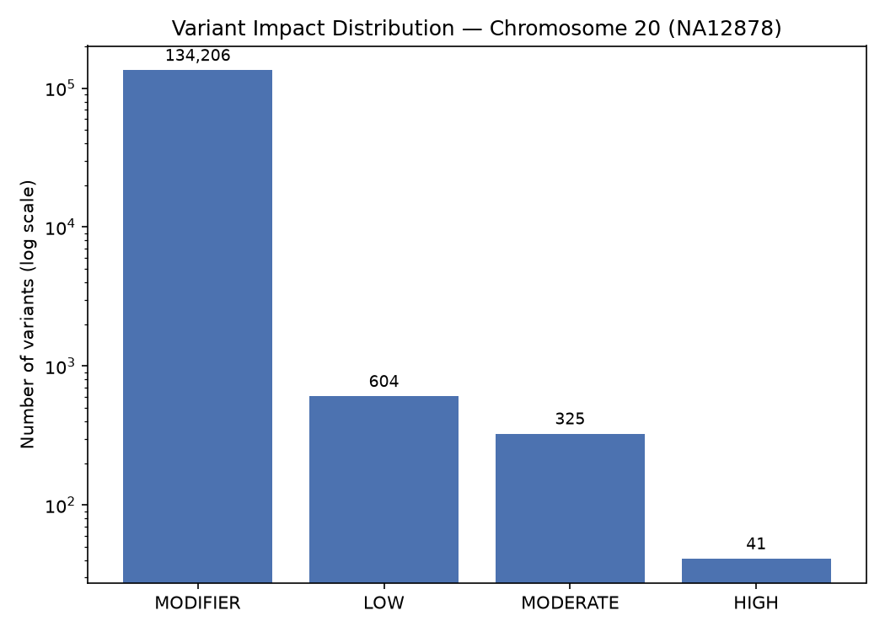
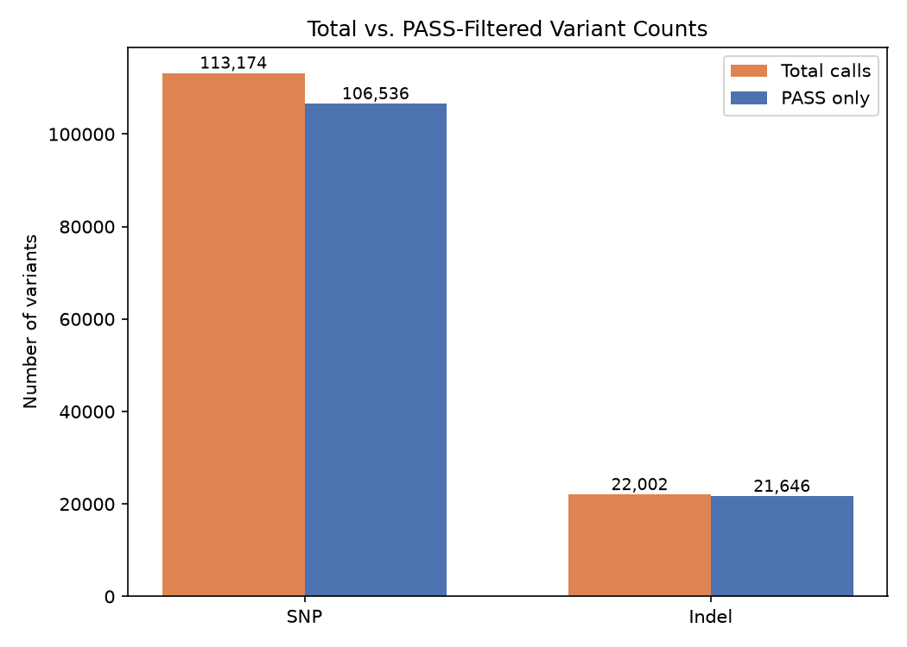

# NA12878 Chromosome 20 Variant-Calling Pipeline

An end-to-end human germline short-variant calling workflow build to  deeply understand how a sequenceing data move from raw sequencing reads, variant calls, benchmarking, and functional annotation.

This project uses real NA12878 (HG001) 30× whole-genome sequencing data and focuses on chromosome 20 to keep computation manageable on limited hardware while retaining the complexity of a real human chromosome.

---

## Overview

| | |
|---|---|
| **Sample** | NA12878 (HG001) — a reference individual whose genome is extensively cross-validated across her family trio (CEPH/Utah pedigree), used worldwide as a benchmarking standard |
| **Scope** | Chromosome 20 only (64,444,167 bp) — a full-sized real chromosome, chosen to keep the pipeline computationally light on limited hardware. |
| **Reference build** | GRCh38 (`GRCh38_full_analysis_set_plus_decoy_hla.fa`) — the exact file NYGC used to align this data, confirmed via their own pipeline documentation (see [References](#references)) |
| **Data source** | NA12878's 30x whole-genome CRAM, NYGC/1000 Genomes 30x GRCh38 collection (ENA project `PRJEB31736`, run `ERR3239334`) |
| **Result** |	135,176 total calls after filtering (128,182 PASS); on PASS calls in GIAB confident regions: 99.2% SNP F1 / 99.1% indel F1
---

## Pipeline



Every step from alignment onward was performed independently in this project. The source CRAM was used only to obtain real reads — its own alignment was discarded and reads were converted back to raw FASTQ before any processing began.

---

## Why this dataset

The selection of **NA12878** was based on the existence of a curated "truth set" of her actual, verified genetic variants (Genome in a Bottle, or GIAB), which was created by cross-validating her sequencing data against that of her parents and children. A real inherited variant must be traceable to a parent in order to detect sequencing/pipeline errors that a single sequencing run alone could not. This enables the measurement of this pipeline's true accuracy rather than merely verifying that it operates.

In order to keep compute and memory needs reasonable on limited hardware without unduly simplifying the problem, **chromosome 20** was selected as a full-sized, unaltered genuine chromosome. This is the same reasoning that makes it the typical "practice chromosome" in GATK's own official tutorials.


---

## Method

### 1. Reference and read extraction

The entire genome is covered by both the original reference (3.26 GB) and NA12878's CRAM (14.7 GB); just chromosome 20 was required. Without downloading either file in its entirety, both were subsetted using their corresponding indexes:

- **Reference**:The reference's chromosome 20 byte range was calculated from its `.fai` index (accounting for FASTA line-wrapping), then extracted via an HTTP/FTP range request; the header (which sits before the extracted byte range) was reconstructed and prepended, producing a complete, valid `chr20_reference.fa`.

- **Reads**: Using indexed, region-based access (`samtools view -T <reference> <remote CRAM> chr20`), the reads of chromosome 20 were taken directly from the remote CRAM and decoded using the precise reference slice mentioned above to guarantee checksum compatibility with the original alignment. The outcome is `na12878_chr20.bam` (~924 MB). Verified with `samtools flagstat`: 99.86% mapped (17,528,783 primary reads); 0.14% (~24k) genuine singletons (mate failed to map at all); an additional ~2% (378,597) had mates mapping to a different chromosome; this was predicted and excluded by this chr20-restricted extraction, not an error.

Through the `bioconda` channel, each tool was gradually installed, one for each pipeline stage, into a special conda environment (`chr20_variant_calling`), which was maintained separate from the system default for reproducibility.


### 2. Converting back to raw FASTQ


The retrieved reads were name-sorted and transformed back into raw paired FASTQ (`samtools fastq`), eliminating all alignment information and retaining simply sequence + quality—the actual beginning point for this project's own, independent pipeline—instead of reusing NYGC's existing alignment. Reads that were unpaired or singular were eliminated.

Verified by direct line-count inspection: (17,528,783 total − 378,597 unmatched) ÷ 2 = **8,575,093**GATK `HaplotypeCaller`** was used in place of a simpler position-by-position caller (e.g. `bcftools call`): it locally reassembles small regions of DNA directly from the reads rather than tallying mismatches independently, giving substantially more accurate results — particularly for indels — and is the field's accepted standard for benchmarking. GATK's Java heap was explicitly capped (`-Xmx2g`) after checking available system memory (3.2 GB), avoiding the JVM's default loose allocation on constrained hardware.

Raw calling produced **135,371 variants**. Variants were split by type (`SelectVariants`) before filtering, since SNPs and indels have different error characteristics and GATK's best-practice hard-filter thresholds differ accordingly:

- **SNPs**: 113,174 total → **106,536 PASS (94.1%)**. Filters: `QD<2.0`, `FS>60.0`, `MQ<40.0`, `MQRankSum<-12.5`, `ReadPosRankSum<-8.0`. Mapping quality (`MQ40`) was the single most common failure reason.
- **Indels**: 22,002 total → **21,646 PASS (98.4%)**. Filters: `QD<2.0`, `FS>200.0`, `ReadPosRankSum<-20.0` (looser than SNP thresholds, reflecting indels' inherently noisier alignment signal). Only `QD2` ever triggered.

Filtering tags variants (FILTER column); it does not delete records — confirmed by identical record counts before and after. SNP:indel ratio (83.6% : 16.4%) matches the well-established ~5:1 pattern in real human variation.

Filtered SNP and indel sets were merged (`MergeVcfs`) into `na12878_chr20.filtered.vcf.gz`: **135,176 records**, exactly matching 113,174 + 22,002. This is 195 fewer than the raw 135,371 total; confirmed via `SelectVariants --select-type-to-include MIXED --select-type-to-include MNP` that exactly 195 raw records are `MIXED`/`MNP`-type sites (positions with both a SNP-like and indel-like allele, or multiple adjacent changed bases) — correctly excluded by both the SNP-only and indel-only selections, since they belong to neither category cleanly.93 reads** in each of `na12878_chr20_R1.fastq` / `_R2.fastq` (2.8 GB each).

*Note: The term "singleton" is used differently by `samtools fastq`' (mate absent from this file) and `flagstat`' (mate failed to map anywhere).*

### 3. Quality control and trimming

FastQC on the raw reads showed consistently high, uniform per-base quality (~28–32, only a mild dip near read ends) — modern sequencing chemistry, not the older sharp drop-off pattern. The one FAIL, "Per sequence GC content," is an expected artifact of restricting the dataset to one chromosome (FastQC compares against a whole-genome GC distribution); all contamination-sensitive modules passed cleanly.

Reads were trimmed with `fastp` as standard defensive practice even given clean QC. Of 17,150,186 total reads, 124,604 (0.726%) were discarded (123,224 low quality, 1,380 excess N, 0 too-short). Adapter sequence was found and trimmed in 292,792 reads despite FastQC's adapter module having passed — a FastQC "pass" reflects contamination below a threshold, not zero contamination. Re-running FastQC on the trimmed output independently confirmed the change (sequence count matched fastp's pass count exactly; read lengths now ranged 31–150 bp).

### 4. Alignment

 The trimmed reads were aligned to `chr20_reference.fa` using alignment `bwa mem` (default settings; unlike a short-read toy dataset, actual ~150 bp reads easily clear the aligner's default seed-length and score thresholds). Verified output: full-length (`150M`) CIGAR strings with high mapping confidence (MAPQ 60) and accurate chromosomal length in the header.

The resultant SAM was indexed, sorted by position, and converted to BAM.


### 5. Duplicate marking

`samtools markdup` requires a mate-score tag added by `samtools fixmate`, which itself requires name-sorted input. The corrected sequence: name-sort → `fixmate -m` → re-sort by position → index → `markdup`.


Before alignment, fastp produced a sequence-based duplication estimate of 6.4%; utilising alignment-based position/orientation information, samtools markdup found 9.88% (1,682,946 of 17,025,582 primary reads). Since the two tools employ different definitions and information—the alignment-based figure is used downstream—these results cannot be directly compared. Duplicates are marked but not eliminated.


### 6. Read groups

@RG metadata (sample, library, platform) was added retroactively (samtools addreplacerg) rather than at alignment time (bwa mem -R, the more standard approach, avoiding an extra BAM rewrite pass). The SM read-group tag identifies the sample represented by the reads and is used by downstream tools, including GATK, when associating reads with sample-level genotypes; incorrect sample metadata can lead to sample-identity mismatches or misleading downstream analysis even when the BAM itself remains technically valid. A matching sequence dictionary (chr20_reference.dict) was also generated for GATK.

### 7. Variant calling and filtering

**GATK `HaplotypeCaller`** was used rather than a simpler position-by-position caller: it locally reassembles small regions of DNA directly from the reads, which is generally more accurate for indels, and is a widely used germline variant caller in the field. GATK's Java heap was explicitly capped (`-Xmx2g`) after checking available system memory (3.2 GB), avoiding the JVM's default loose allocation on constrained hardware.

Raw calling produced **135,371 variants**. Variants were split by type (`SelectVariants`) before filtering, since SNPs and indels have different error characteristics and GATK's best-practice hard-filter thresholds differ accordingly:

- **SNPs**: 113,174 total → **106,536 PASS (94.1%)**. Filters: `QD<2.0`, `FS>60.0`, `MQ<40.0`, `MQRankSum<-12.5`, `ReadPosRankSum<-8.0`. Mapping quality (`MQ40`) was the single most common failure reason.
- **Indels**: 22,002 total → **21,646 PASS (98.4%)**. Filters: `QD<2.0`, `FS>200.0`, `ReadPosRankSum<-20.0` (looser than SNP thresholds, reflecting indels' inherently noisier alignment signal). Only `QD2` ever triggered.

Filtering tags variants (FILTER column); it does not delete records — confirmed by identical record counts before and after.

Filtered SNP and indel sets were merged (`MergeVcfs`) into `na12878_chr20.filtered.vcf.gz`: **135,176 records** (113,174 + 22,002). This is 195 fewer than the raw 135,371 total; confirmed via `SelectVariants --select-type-to-include MIXED --select-type-to-include MNP` that exactly 195 raw records are `MIXED` or `MNP` type (sites with mixed allele types, or multiple adjacent changed bases represented as one allele) and were therefore not included in either the SNP-only or indel-only sets. The final filtered set contains 113,174 SNPs and 22,002 indels (83.7% : 16.3%).


### 8. Benchmarking against the GIAB truth set

The GIAB NISTv4.2.1 GRCh38 truth set for NA12878/HG001 (benchmark VCF + confident-regions BED) was downloaded and restricted to chromosome 20 (`bcftools view -r chr20`; `awk` for the BED), for a scope-matched comparison. *(The confident-regions BED filename was initially guessed incorrectly — a suffix that in fact belongs to a different GIAB sample, HG002 — caught by inspecting the downloaded file's size and content rather than trusting a "100% complete" download report, and corrected against the real directory listing.)*

Comparison was run with `hap.py`, using RTG's `vcfeval` as the comparison engine — a combination hap.py's own documentation discusses as a more sophisticated alternative to its simpler built-in comparison logic. (`hap.py` requires Python 2 and was installed in an isolated `happy_env` to avoid conflicting with the main Python 3.10 pipeline environment.)


### 9. Annotation

**`SnpEff`** (database `GRCh38.p14`, RefSeq transcripts) annotated every variant with gene, region type, and predicted severity. *(SnpEff required a newer Java runtime than GATK's — resolved by installing it into a separate `snpeff_env` with `openjdk=21`. An initial `OutOfMemoryError` loading the whole-genome gene database was resolved by explicitly raising the Java heap, first to 2 GB — insufficient — then to 3 GB, which succeeded.)*

SnpEff's impact categories are computational predictions based on variant-consequence models; they are not experimental measurements of biological effect (see [Manual IGV review](#manual-igv-review-of-selected-high-impact-calls) below for a concrete example of why this distinction matters).

---

## Results

### Variant counts

| Stage | SNPs | Indels | Total |
|---|---|---|---|
| Raw calls | 113,174 | 22,002 | 135,371 (includes 195 MIXED/MNP sites excluded below) |
| PASS (filtered) | 106,536 (94.1%) | 21,646 (98.4%) | 128,182 |
| Merged filtered set (PASS + FAIL) | — | — | **135,176** |

### Benchmark performance within GIAB confident regions

| Type | Filter | Calls evaluated | Recall | Precision | F1 |
|---|---|---|---|---|---|
| SNP | ALL | 113,174 | 99.52% | 98.73% | 0.991 |
| SNP | **PASS** | 106,536 | **99.28%** | **99.14%** | **0.992** |
| Indel | ALL | 22,843 | 98.99% | 99.26% | 0.991 |
| Indel | **PASS** | 22,487 | **98.97%** | **99.32%** | **0.991** |



A large fraction of raw calls fell outside the truth set's confident regions (regions even GIAB cannot confidently judge — e.g. repetitive or low-mappability sequence); those calls are unscored ("UNK"), not necessarily incorrect. Filtering improved precision but slightly reduced recall (SNP: 99.52% → 99.28%) — an expected trade-off, since quality filters judge indirect statistical evidence rather than ground truth directly.

### Variant impact distribution (SnpEff, GRCh38.p14)

| Impact | Count | % |
|---|---|---|
| MODIFIER | 134,206 | 99.3% |
| LOW | 604 | 0.4% |
| MODERATE | 325 | 0.2% |
| HIGH | 41 | 0.03% |




---

## Manual IGV review of selected high-impact calls

Three of the 41 `HIGH`-impact variants were selected to demonstrate how computational annotations can be inspected against the underlying read evidence — not as biological findings about these genes.

| Gene | Position | Zygosity | AD | QD | MQ | Note |
|---|---|---|---|---|---|---|
| ABHD12 | chr20:25,303,302 | 1/1 (hom.) | 0:27 | 30.4 | 60.0 | Frameshift annotated at protein position 426/426 of transcript `XM_047440087.1` (not the 398 aa canonical UniProt isoform) |
| SIRPB1 | chr20:1,611,396 / 1,611,401 / 1,611,406 | 0/1 (het.) | 16:5 | 7.36 | 55.5 | Three adjacent calls, identical supporting-read statistics |
| DZANK1 | chr20:18,412,855 | 1/1 (hom.) | 0:25 | 32.8 | 60.0 | Splice-acceptor-site variant, annotated across 15 RefSeq transcripts |

**ABHD12** — read evidence is unambiguous (27/27 reads support the insertion). SnpEff reports the frameshift at position 426 of a 426-residue transcript (`XM_047440087.1`); UniProt's canonical isoform is 398 residues, so this figure reflects the specific annotated transcript rather than a single agreed-upon protein length — ABHD12 has multiple documented isoforms of different lengths. Because the predicted frameshift occurs at or near the final codon of the annotated transcript, its biological consequence is less straightforward than the generic `HIGH` label suggests. This illustrates why automated impact categories should not be treated as definitive functional conclusions.

**SIRPB1** — the three adjacent calls have identical supporting-read statistics (AD, DP, QD, MQ), suggesting they may represent different VCF representations of the same underlying local haplotype or complex event, rather than three independent mutations. This illustrates why adjacent variant calls are sometimes better interpreted together than independently.

**DZANK1** — a splice-acceptor-site variant that alters the canonical splice-acceptor sequence and is predicted to disrupt normal splicing. Strong, high-quality evidence (QD 32.8, mapping quality 60). The variant was annotated at the corresponding splice-acceptor position across 15 transcripts in SnpEff's RefSeq-based database for this gene — this reflects the annotation database used, not independent experimental confirmation.

*(Add saved IGV screenshots to `results/igv_abhd12.png`, `results/igv_sirpb1.png`, `results/igv_dzank1.png` and reference them here.)*

---

## Limitations

- Variant calling and alignment used the original (2015) unpatched GRCh38 reference file; SnpEff's annotation database uses patch level p14. For chromosome 20's main sequence this is very unlikely to cause discrepancies, but was not independently verified.
- SnpEff's `HIGH` impact category does not account for a frameshift's position within the protein (see ABHD12 above); manual review of high-impact calls is necessary before drawing biological conclusions.
- Hard filters, not VQSR, were used — appropriate for a single-sample project; VQSR is generally preferred at cohort scale.
- GIAB confident regions do not cover every genomic position; variants outside these regions are not necessarily false, they are simply excluded from the high-confidence benchmark evaluation.
- This project demonstrates a single-sample germline calling workflow and does not address joint genotyping, cohort-level filtering, population frequency estimation, or somatic variant calling.
- Scope is limited to chromosome 20 of a single individual and is not a substitute for whole-genome analysis.
- Wall-clock runtime per stage was not systematically logged during development.

---

## Reproducibility

```
na12878-chr20-variant-calling/
├── README.md
├── scripts/
│   ├── run_pipeline.sh       # full command sequence, in order
│   └── plot_results.py       # generates the result figures below
├── results/
│   ├── benchmark_scores.png
│   ├── impact_distribution.png
│   ├── total_vs_pass.png
│   ├── igv_abhd12.png
│   ├── igv_sirpb1.png
│   └── igv_dzank1.png
├── na12878_chr20.filtered.vcf.gz
├── na12878_chr20.annotated.vcf
├── high_impact_variants.txt
├── benchmark_results.summary.csv
└── LICENSE
```

```bash
conda create -n chr20_variant_calling python=3.10 sra-tools samtools bcftools bwa fastqc fastp gatk4 -c bioconda -c conda-forge -y
conda create -n happy_env -c bioconda -c conda-forge hap.py rtg-tools -y
conda create -n snpeff_env -c bioconda -c conda-forge snpeff openjdk=21 -y
```

**Tool versions used**

| Tool | Version |
|---|---|
| Python | 3.10 |
| sra-tools | 3.4.1 |
| samtools | 1.24 |
| bwa | 0.7.19-r1273 |
| FastQC | 0.12.1 |
| fastp | 1.3.6 |
| GATK | 4.3.0.0 |
| bcftools | not explicitly recorded during this project |
| hap.py | 0.3.15 |
| RTG Tools | 3.13 |
| SnpEff | 5.4c |
| OpenJDK (SnpEff env) | 21 |
| IGV | web app (igv.org/app), version not pinned |

Run `scripts/run_pipeline.sh` stage by stage (it is written for review and reproduction, not unattended execution — several stages require switching conda environments, noted inline). `scripts/plot_results.py` regenerates the result figures from the numbers in this README.

**Data sources**
- Reads: ENA run `ERR3239334` (NA12878, NYGC 30x GRCh38, project `PRJEB31736`)
- Reference: `ftp://ftp.1000genomes.ebi.ac.uk/vol1/ftp/technical/reference/GRCh38_reference_genome/GRCh38_full_analysis_set_plus_decoy_hla.fa`
- Truth set: GIAB NISTv4.2.1, GRCh38 (`HG001_GRCh38_1_22_v4.2.1_benchmark.vcf.gz` + `HG001_GRCh38_1_22_v4.2.1_benchmark.bed`)

---

## References

- GATK Best Practices — https://gatk.broadinstitute.org/hc/en-us/sections/360007226651-Best-Practices-Workflows
- hap.py / vcfeval — https://github.com/Illumina/hap.py
- Genome in a Bottle (GIAB) — https://www.nist.gov/programs-projects/genome-bottle
- SnpEff — https://pcingola.github.io/SnpEff/
- 1000 Genomes 30x on GRCh38 (NYGC) — https://www.internationalgenome.org/data-portal/data-collection/30x-grch38
- NYGC GRCh38 alignment pipeline description — linked from the collection page above

---


